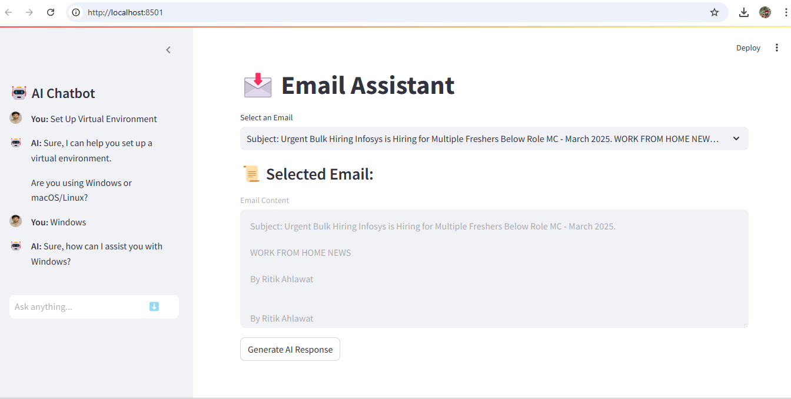

# autogen-chatbot-email-assistant
 An AI-powered chatbot and email assistant built using AutoGen, FastAPI, and Streamlit. This project enables intelligent conversations and assists with email tasks using natural language processing (NLP). Integrated with a PostgreSQL database for efficient data handling.
1)  AI-powered chatbot using AutoGen
2)  Email assistant for smart email handling
3)  Streamlit UI for user interaction
4)  FastAPI backend for seamless API communication

Installation
1)  Clone the Repository
    git clone https://github.com/shrishailwali/autogen-chatbot-email-assistant.git
    cd autogen-ai-assistant

2)  Set Up Virtual Environment
    python -m venv venv
    source venv/bin/activate  # Mac/Linux  
    venv\Scripts\activate  # Windows 

3)  Install Dependencies
    pip install -r requirements.txt

4)  Run the FastAPI Backend
    cd backend
    uvicorn main:app --reload

5)  Run the Streamlit UI
    cd frontend
    streamlit run app.py

